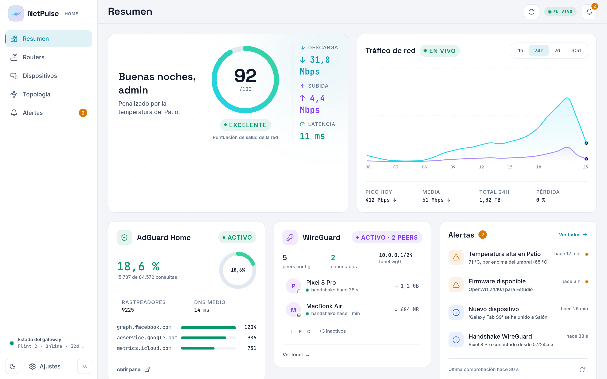
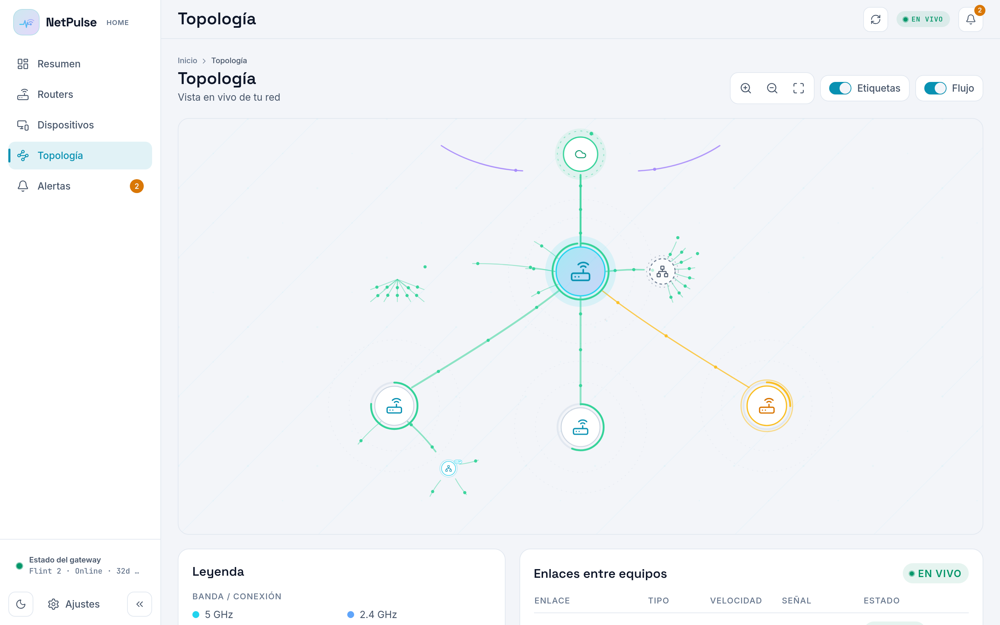
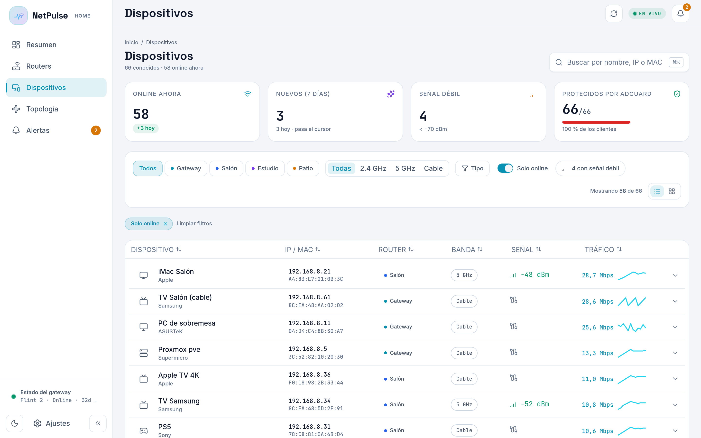
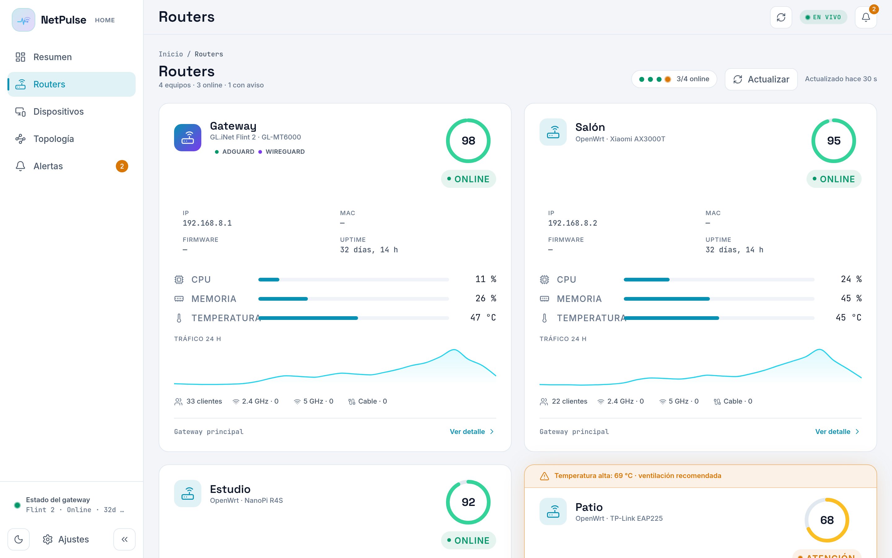

# NetPulse

<p align="center">
  <a href="README.md">English</a> |
  <a href="README.es.md">Español</a>
</p>

<p align="center">
  <a href="https://github.com/gnacho/netpulse/releases"></a>
  <a href="https://github.com/gnacho/netpulse/actions/workflows/release.yml"></a>
  <a href="LICENSE"></a>
</p>

<p align="center">
  <picture>
    <source media="(prefers-color-scheme: dark)" srcset="assets/hero-es-dark.png">
    <source media="(prefers-color-scheme: light)" srcset="assets/hero-es-light.png">
    
  </picture>
</p>

NetPulse es una PWA de solo lectura para monitorizar una red doméstica
construida con routers OpenWrt/GL.iNet: estado de la flota, salud por
router, dispositivos conectados, mapa de topología en vivo, peers
WireGuard, estadísticas de AdGuard Home y alertas, en tiempo real. Un
único binario Go estático con el frontend embebido, autoalojado en una
caja Linux pequeña.

## ¿Por qué existe?

Siempre he creído en la soberanía digital: si un dispositivo te hace
depender de su cloud, de su firmware o de su fabricante, no es 100% tuyo.
Por eso siempre he priorizado hardware que se pueda flashear o rootear.
La distribución de mi casa acabó con cuatro routers: un Flint 2 como
principal y tres puntos de acceso Xiaomi AX6 comprados de segunda mano a
30 euros cada uno. Baratos, potentes, y todos corriendo OpenWrt. Esa
soberanía me permitió orquestar y personalizar la red a mi antojo (no sin
ciertos desafíos), pero siempre eché en falta una vista unificada de lo
que pasaba: qué se conecta dónde, qué va bien, qué no. No había nada, o
no supe encontrarlo, así que me puse manos a la obra. NetPulse es ese
visor global: analiza tu red, detecta anomalías y te avisa.

## ¿Por qué este stack?

- **Go, un único binario estático**: un monitor 24/7 en un LXC pequeño.
  ServeMux de `net/http` de la stdlib, sin framework, `go:embed` para el
  frontend. Actualizar es cambiar un fichero.
- **`modernc.org/sqlite`, CGO off**: totalmente estático, sin toolchain C
  en el destino. Series temporales, usuarios y sesiones en un único
  fichero SQLite embebido (WAL).
- **Solo lectura por diseño**: el servidor genera su propio par de claves
  ed25519; autorizas la clave pública en cada router y solo lee (ubus,
  `/proc`, iwinfo, `bridge fdb`, `wg show`). No puede cambiar tu red.
- **PWA React 19 + Vite + Tailwind**: instalable, en vivo por SSE (5 s),
  la misma shell de UI que mis otras apps.
- **systemd, sin Docker**: monitoriza una red; no necesita un contenedor
  para hacerlo.

## Características

- **Resumen de flota**: puntuación de salud, tráfico en vivo, latencia,
  estado por router (CPU, memoria, temperatura, uptime).
- **Mapa de topología en vivo**: inferido del FDB del bridge (y LLDP
  cuando está disponible), con clientes cableados e inalámbricos, switches
  e hipervisores detectados, y túneles WireGuard dibujados de peer a
  Internet.
- **Dispositivos**: cada cliente con clasificación por tipo (patrones de
  hostname + OUI), primer visto, banda, señal.
- **WireGuard**: peers, últimos handshakes, transferencia por peer.
- **AdGuard Home**: estadísticas de consultas y dominios más bloqueados.
- **Alertas**: temperatura, firmware disponible, nuevo dispositivo,
  handshake, con feed en la campana.
- **Auth multiusuario**: contraseñas bcrypt, idioma por usuario (ES/EN),
  roles admin y viewer.
- **Modo demo** (`DEMO_MODE=1`): una red de muestra de 67 dispositivos,
  sin necesidad de routers.
- **Sidecar collector opcional**: sondeo de latencia TCP por router con
  sus propias series temporales de largo plazo.

## Capturas

**Topología: inferida en vivo del FDB del bridge, túneles incluidos**

<picture>
  <source media="(prefers-color-scheme: dark)" srcset="assets/screenshot-topology-es-dark.png">
  <source media="(prefers-color-scheme: light)" srcset="assets/screenshot-topology-es-light.png">
  
</picture>

**Dispositivos: cada cliente clasificado, con banda y señal**

<picture>
  <source media="(prefers-color-scheme: dark)" srcset="assets/screenshot-devices-es-dark.png">
  <source media="(prefers-color-scheme: light)" srcset="assets/screenshot-devices-es-light.png">
  
</picture>

**Routers: salud por router de un vistazo**

<picture>
  <source media="(prefers-color-scheme: dark)" srcset="assets/screenshot-router-es-dark.png">
  <source media="(prefers-color-scheme: light)" srcset="assets/screenshot-router-es-light.png">
  
</picture>

## Qué debes esperar

NetPulse es un proyecto personal, construido para mi propia red y
publicado como software libre (AGPL-3.0). Es y será siempre libre. Trabajo
en él en mi tiempo libre: hay muchas ideas para mejoras, pero poco tiempo,
y evoluciona siguiendo primero mis propias necesidades. Con colaboraciones
o apoyo quizás podría crecer más rápido, pero no puedo prometer nada.
**Nota honesta de alcance**: de momento solo se ha probado con mi propio
hardware (un gateway GL.iNet Flint 2 y tres puntos de acceso Xiaomi AX6
con OpenWrt), además de WireGuard y AdGuard Home. Otros dispositivos
OpenWrt deberían funcionar, pero el tuyo sería el primero en contarlo.

## Roadmap

| Fase | Estado | Highlights |
|---|---|---|
| **1 — Base read-only** | ✅ | PWA en React, sondeo SSH de solo lectura (ubus, `/proc`, iwinfo), AdGuard Home + WireGuard, auth multi-usuario, discovery LAN, backend migrado de Node a Go (binario único con la app embebida) |
| **5 — Topología v5** | ✅ | Mapa semántico real: FDB + LLDP en vivo, backhaul, switches gestionados vs. inferidos, hipervisores con sus CTs anidados, collector de series temporales |
| **6 — Alertas, Push y agente (piloto)** | ✅ | Alertas con 6 categorías y config por categoría (urgente/todo/nada), Web Push nativo (VAPID), refresco bajo demanda, auditoría switch/bridge con canon de datos reconciliado, agente OpenWrt piloto (ingesta con tokens, fallback SSH, procd) |
| **6.5 — View-model versionado** | ✅ | API como view-model de presentación (`vm: 1`), canon demo single-source en Go → JSON, `Device.infra` sellado server-side, topología semántica en el snapshot, remodel de Preferencias (nombre de saludo, info de sistema real, AdGuard/usuarios/routers simplificados) |
| **8 — Resiliencia del agente** | ✅ | Watchdog + heartbeat en el router (v2.3.0), rearme manual desde el servidor (v2.4.0), auto-rearme tras TTL (v2.4.0) y rutas de mutación solo-admin (v2.4.1) |
| **7 — TLS y endurecimiento** | 🔮 | HTTPS en CT 226 (desbloquea Web Push real), HMAC-SHA256 en la ingesta del agente, servir el binario del agente desde el propio servidor |
| **9 — Agente a fondo** | ⏳ | netlink/nl80211 nativo, eventos ubus en tiempo real, paquete `.ipk`, medición en hardware real |
| **10 — Cliente en el router** | 🔮 | `luci-app-netpulse`: cliente ligero LuCI que consume el view-model versionado (la 6.5 deja la API lista para esto) |
| **11 — Escritura/orquestación** | 🔮 | Plan → apply → state (patrón Terraform), `uci` transaccional, allowlist estricta; empieza por AdGuard Home |
| **Backlog** | 📋 | Integrar las series del collector en server-go · verificación de push real (FCM) · retención de series + informe semanal |

Detalle completo en [docs/ROADMAP.md](docs/ROADMAP.md).

## Instalación

Requisitos: Linux (x86_64, arm64 o armv7) con systemd.

```bash
curl -fsSL https://raw.githubusercontent.com/gnacho/netpulse/main/install.sh | sh   # (recomendado)
```

El instalador es shell plano y legible: [inspecciónalo primero](install.sh).
Detecta tu distro y arquitectura, descarga la release verificada (sha256
contra `checksums.txt`), crea un servicio systemd `netpulse` enjaulado y
muestra la contraseña inicial de admin una sola vez. Actualiza
re-ejecutando la misma línea; desinstala con `sh install.sh --uninstall`.

Sidecar de latencia opcional (series temporales de sondeo TCP por router):

```bash
curl -fsSL https://raw.githubusercontent.com/gnacho/netpulse/main/install-collector.sh | sh
```

Los binarios estables se publican por tag `v*` (goreleaser); los builds
rolling por commit viven en la prerelease `go-latest` para el updater
in-app.

## Conectar tus routers

El servidor genera su propio par de claves ed25519 y muestra la clave
pública en Ajustes. Autorízala en cada router que quieras monitorizar
(`/etc/dropbear/authorized_keys`). El gateway se autodetecta en el primer
arranque por descubrimiento LAN (barrido TCP :22, fingerprint ubus/GL-UI);
el resto se añade desde Ajustes. El sondeo es estrictamente de solo
lectura.

## Desarrollo

```bash
# Backend (Go; sirve app/dist vía go:embed)
cd server-go
cp ../app/dist internal/staticspa/dist -r   # el dist embebido nunca se trackea
go build -o netpulse ./cmd/netpulse && DEMO_MODE=1 ./netpulse

# Frontend (dev server con proxy)
cd app
npm install
npm run dev
```

El backend Node legado (`server/`) está archivado como fallback
documentado; la migración desde su base de datos ocurre automáticamente en
el primer arranque Go.

## Tests

```bash
cd server-go && go test ./...
```

## Licencia

[AGPL-3.0](LICENSE)
