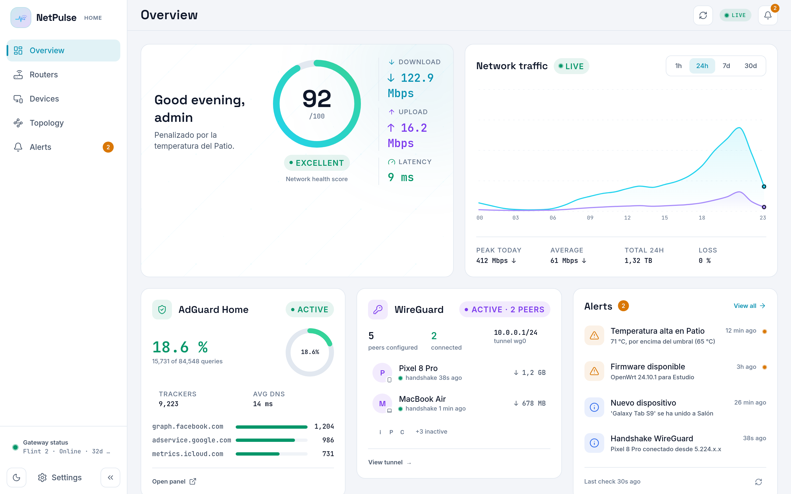
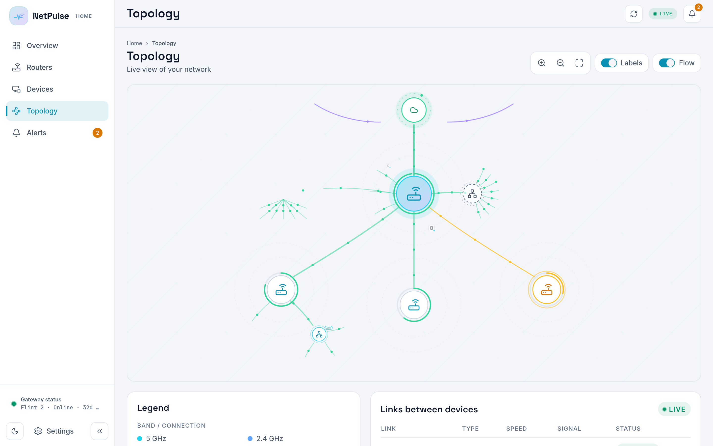
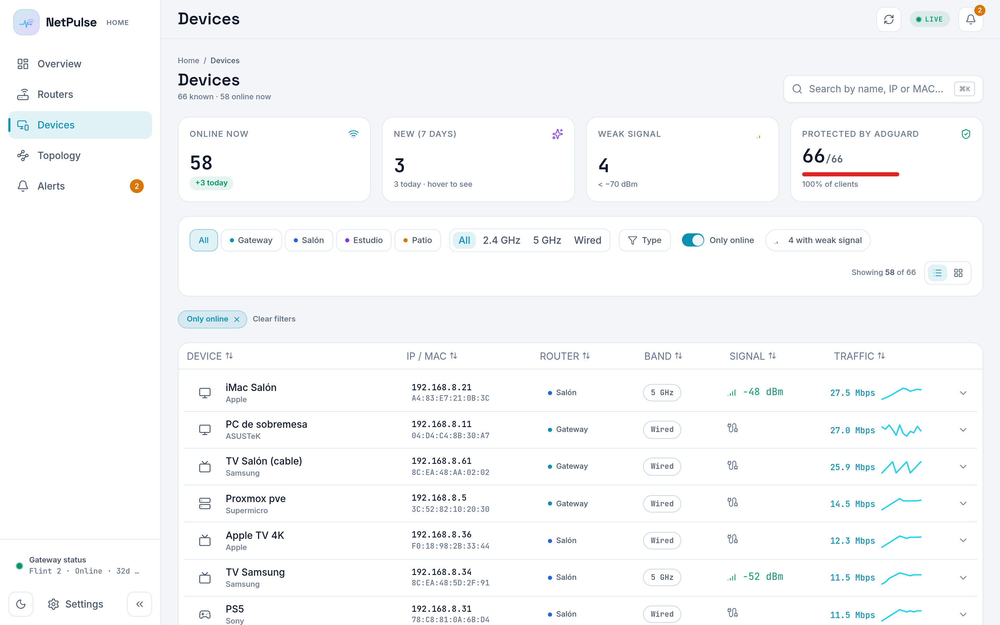
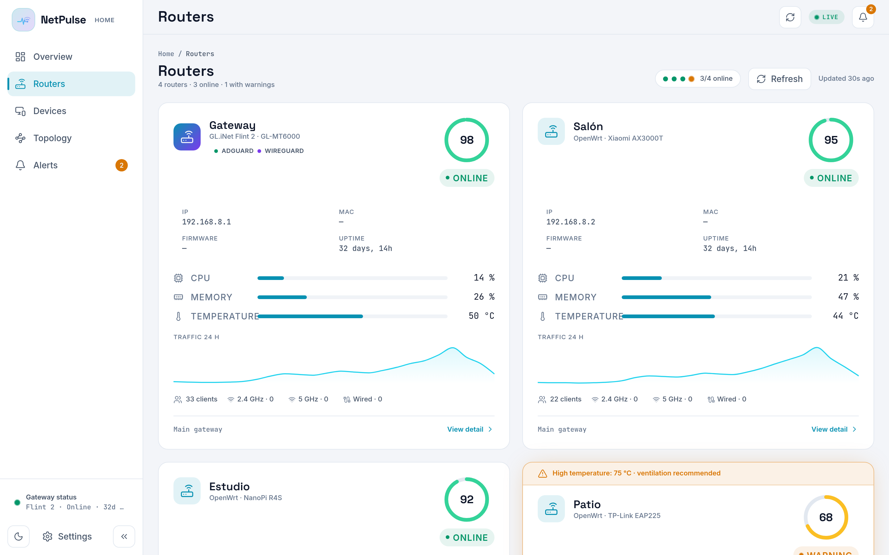

# NetPulse

<p align="center">
  <a href="README.md">English</a> |
  <a href="README.es.md">Español</a>
</p>

<p align="center">
  <a href="https://netpulse.cloudless.club"></a>
  <a href="https://demo.netpulse.cloudless.club"></a>
  <a href="https://github.com/gnacho/netpulse/releases"></a>
  <a href="https://github.com/gnacho/netpulse/actions/workflows/release.yml"></a>
  <a href="LICENSE"></a>
  <a href="https://ko-fi.com/gnacho"></a>
</p>

<p align="center"><a href="https://demo.netpulse.cloudless.club"><strong>Try the live demo</strong></a> on <code>demo.netpulse.cloudless.club</code></p>

<p align="center">
  <picture>
    <source media="(prefers-color-scheme: dark)" srcset="assets/hero-en-dark.png">
    <source media="(prefers-color-scheme: light)" srcset="assets/hero-en-light.png">
    
  </picture>
</p>

NetPulse is a read-only PWA for monitoring a home network built on
OpenWrt/GL.iNet routers: fleet status, per-router health, connected devices,
a live topology map, WireGuard peers, AdGuard Home stats and alerts, in real
time. One static Go binary with the frontend embedded, self-hosted on a
small Linux box.

> **Try the live demo**
>
> See it running without installing anything. Head to **[demo.netpulse.cloudless.club](https://demo.netpulse.cloudless.club)** — a full sample network, no sign-up required. In read-only mode, so you can explore freely.

## Why does this exist?

I believe in digital sovereignty: if a device makes you depend on its
cloud, its firmware or its vendor, it isn't 100% yours. That's why I've
always favored hardware I can flash or root. My home layout ended up with
four routers: a Flint 2 as the main one and three Xiaomi AX6 access points
bought second-hand for 30 euros each. Cheap, powerful, and all running
OpenWrt. That sovereignty let me orchestrate and personalize the network
exactly how I wanted (not without some challenges), but I always missed a
unified view of what was going on: what connects where, what's healthy,
what isn't. There was nothing out there, or I couldn't find it, so I built
it. NetPulse is that global viewer: it analyzes your network, spots
anomalies, and warns you.

## Why this stack?

- **Go, single static binary**: a 24/7 monitor on a small LXC. The stdlib
  `net/http` ServeMux, no framework, `go:embed` for the frontend. Upgrade
  is swapping one file.
- **`modernc.org/sqlite`, CGO off**: fully static, no C toolchain needed
  on the target. Time series, users and sessions in one embedded SQLite
  file (WAL).
- **Read-only by design**: the server generates its own ed25519 keypair;
  you authorize the public key on each router and it only ever reads
  (ubus, `/proc`, iwinfo, `bridge fdb`, `wg show`). It cannot change your
  network.
- **React 19 + Vite + Tailwind PWA**: installable, live over SSE (5 s),
  the same UI shell as my other apps.
- **systemd, no Docker**: it monitors a network; it doesn't need a
  container to do it.

## Features

- **Fleet overview**: health score, live traffic, latency, per-router
  status (CPU, memory, temperature, uptime).
- **Live topology map**: inferred from the bridge FDB (and LLDP when
  available), with wired/wireless clients, switches and hypervisors
  detected, WireGuard tunnels drawn peer to Internet.
- **Devices**: every client with type classification (hostname patterns +
  OUI), first seen, band, signal.
- **WireGuard**: peers, latest handshakes, transfer per peer.
- **AdGuard Home**: query stats and top blocked domains.
- **Alerts**: temperature, firmware available, new device, handshake, with
  a bell feed.
- **Multi-user auth**: bcrypt passwords, per-user language (ES/EN), admin
  and viewer roles.
- **Demo mode** (`DEMO_MODE=1`): a 67-device sample network, no routers
  needed.
- **Optional collector sidecar**: TCP latency probes per router with its
  own long-term time series.

### What gets discovered

NetPulse discovers client devices from three sources that run on the monitored routers:

1. **DHCP leases** - every time the agent polls, it reads the local DHCP lease table.
2. **Bridge FDB** - wired clients are learned from the switch bridge forwarding database.
3. **mDNS / Bonjour** - when `umdns` is installed on OpenWrt, the agent browses advertised services and resolves hostnames.

LLDP is used only to identify neighbouring routers/switches, not end devices. Discovery requires the NetPulse agent to be running on the router that sees the clients; a fresh install with only manually onboarded routers and no agent on the gateway will show an empty device list until the agent is installed.

## Screenshots

**Topology: inferred live from the bridge FDB, tunnels included**

<picture>
  <source media="(prefers-color-scheme: dark)" srcset="assets/screenshot-topology-en-dark.png">
  <source media="(prefers-color-scheme: light)" srcset="assets/screenshot-topology-en-light.png">
  
</picture>

**Devices: every client classified, with band and signal**

<picture>
  <source media="(prefers-color-scheme: dark)" srcset="assets/screenshot-devices-en-dark.png">
  <source media="(prefers-color-scheme: light)" srcset="assets/screenshot-devices-en-light.png">
  
</picture>

**Routers: per-router health at a glance**

<picture>
  <source media="(prefers-color-scheme: dark)" srcset="assets/screenshot-router-en-dark.png">
  <source media="(prefers-color-scheme: light)" srcset="assets/screenshot-router-en-light.png">
  
</picture>

## What to expect

NetPulse is a personal project, built for my own network and released as
free software (AGPL-3.0). It is and will always be free. I work on it in my
free time: there's a long list of ideas, but little time, and it evolves
following my own needs first. With contributions or support it might grow
faster, but I can't promise anything. **Honest scope note**: so far it has
only been tested with my own hardware (a GL.iNet Flint 2 gateway and three
Xiaomi AX6 access points running OpenWrt) plus WireGuard and AdGuard Home.
Other OpenWrt devices should work, but yours would be the first to tell.

## Roadmap

| Phase | Status | Highlights |
|---|---|---|
| **1 — Topology v5** | ✅ | Semantic map: live FDB + LLDP, backhaul, managed vs. inferred switches, hypervisors with nested CTs, time-series collector |
| **2 — Alerts, Push & agent pilot** | ✅ | 6-category alerts, native Web Push (VAPID), on-demand refresh, OpenWrt agent pilot (token ingest, SSH fallback, procd) |
| **3 — Read-only base + Node→Go** | ✅ | React PWA, read-only SSH polling (ubus, /proc, iwinfo), AdGuard + WireGuard, multi-user auth, backend migrated to a single Go binary |
| **4 — View-model + Settings revamp** | ✅ | API as a presentation view-model (`vm: 1`), single-sourced demo canon, semantic topology in the snapshot |
| **5 — Agent resilience** | ✅ | Router-side watchdog + heartbeat, server-side manual rearm, TTL auto-rearm, admin-only mutation routes |
| **6 — Agent security** | ✅ | HMAC-SHA256 on agent ingest, serve the agent binary from the server itself |
| **7 — Agent deep dive** | ✅ | Real-time wifi events (`iw event`), bidirectional SSE, `.ipk` packaging (11-12 MB RSS, <1% CPU) |
| **8 — Consolidation** | ✅ | `/api/health` metrics, persistent agent registry, retention ladder (raw 7d → 5min buckets 1y → daily ∞), recharts v3, outgoing alert webhooks |
| **9 — On-box** | ✅ | UCI config, AUTH_PASS bootstrap, TLS self-signed + SPKI pinning, pairing token, OpenWrt server package |
| **10 — Orchestration** | ✅ | Plan→apply→state engine + sandboxed executor (10.1), AdGuard (10.2), WiFi guest, DDNS, SQM, usteer modules. WireGuard moved to Phase 17 |
| **11 — LuCI package** | ✅ | `luci-app-netpulse` shipped as `.ipk`/`.apk` on every release: local agent status/view (procd, UCI, logs, restart/rearm) + bridge to the web app |
| **12 — Security audit** | ✅ | TRUST_PROXY, anti-replay on ingest, body cap, password min 10 |
| **13 — Robustness audit** | ✅ | Single-flight GetOverview, SSE write deadline, sshpool dial race, error wrapping |
| **14 — WiFi/roaming visibility** | ✅ | DAWN signal matrix, 802.11r status per SSID, channel utilization survey, persistent roaming events feed (30d) |
| **15 — Reports** | 🔄 | Daily/week/month availability. Pending: traffic, activity, alert summary, export |
| **16 — Advanced alerts** | 🔮 | Custom threshold rules, new alert types (roaming failure, channel congestion), scheduled silence, email |
| **17 — Write to routers** | 🔄 | UCI ownership + safe apply with rollback (#451), channel planning (#452), firmware upgrades (#453); full module index (AdGuard full, WiFi guest, DDNS, QoS, WireGuard, OpenVPN, Tailscale, Batman, DPI) |
| **18-20 — Beta-testing program** | 🔮 | Module groups by risk (low / medium / high) with stable + unstable release channels and external beta-testers |

Full detail in [docs/ROADMAP.md](docs/ROADMAP.md).

## Installation

Requirements: Linux (x86_64, arm64 or armv7) with systemd.

```bash
curl -fsSL https://raw.githubusercontent.com/gnacho/netpulse/main/install.sh | sh   # (recommended)
```

The installer is plain, readable shell: [inspect it first](install.sh). It
detects your distro and arch, downloads the verified release (sha256
against `checksums.txt`), creates a sandboxed `netpulse` systemd service
and prints the initial admin password once. Update by re-running the same
line; remove with `sh install.sh --uninstall`.

Optional latency sidecar (time series of TCP probes to each router):

```bash
curl -fsSL https://raw.githubusercontent.com/gnacho/netpulse/main/install-collector.sh | sh
```

Stable binaries are published per `v*` tag (goreleaser); rolling per-commit
builds live in the `go-latest` prerelease for the in-app updater.

## Connecting your routers

The server generates its own ed25519 keypair and shows the public key in
Settings. Authorize it on each router you want to monitor
(`/etc/dropbear/authorized_keys`). The gateway is auto-detected on first
boot via LAN discovery (TCP :22 sweep, ubus/GL-UI fingerprint); the rest
are added from Settings. Polling is strictly read-only.

### Installing the agents (recommended: let the app do it)

Once the router is in the table and its SSH key is authorized, the app can
install and start the agent by itself: Settings → Agents → **Reinstall**.
Over one SSH session the server detects the architecture, downloads the
embedded agent binary from itself (token-authenticated), verifies its
SHA256, writes the config, installs the procd init (with a self-heal step
that re-downloads the binary after a `sysupgrade`, which only preserves
`/etc`), sets up the watchdog cron and restarts the service. The agent
shows up as connected within seconds. Re-running it is safe: it rotates
the token and reinstalls.

## OpenWrt packages

Every `v*` release ships the agent and the LuCI app as installable OpenWrt
packages alongside the tarballs:

- `netpulse-agent` as `.ipk` (OpenWrt 24.10 SDK, mediatek/filogic) and `.apk`
  (OpenWrt 25.12 SDK, qualcommax/ipq807x).
- `luci-app-netpulse` as `.ipk` and `.apk` (`all` arch, any target): LuCI
  pages that show the local agent status, let you restart it, edit its UCI
  config and jump to the NetPulse web app.

Grab the assets from the
[latest release](https://github.com/gnacho/netpulse/releases) and install on
the router (LuCI System > Software, or over SSH):

```sh
# OpenWrt 24.10 (ipk)
opkg install ./netpulse-agent_*.ipk ./luci-app-netpulse_*.ipk

# OpenWrt 25.12 (apk)
apk add --allow-untrusted ./netpulse-agent-*.apk ./luci-app-netpulse-*.apk
```

`luci-app-netpulse` depends on `netpulse-agent` and `luci-base`; installing
both packages together resolves the dependencies without extra feeds. After
install, LuCI picks up the new pages automatically (the package restarts
`rpcd` and clears the index cache).

The package ships an empty config, so the service stays inactive until you
point it at your server (the app cannot know these values). Create the
agent in the web UI (Settings → Agents) to get its one-time token, then on
the router:

```sh
uci set netpulse-agent.main.server='http://<netpulse-server-ip>:3000'
uci set netpulse-agent.main.slug='<slug>'
uci set netpulse-agent.main.token='<64-hex token>'
uci commit netpulse-agent
service netpulse-agent enable && service netpulse-agent start
```

If the server can already SSH into the router, prefer the automated path
above: **Reinstall** does all of this for you.

## Development

```bash
# Backend (Go; serves app/dist via go:embed)
cd server-go
cp ../app/dist internal/staticspa/dist -r   # the embedded dist is never tracked
go build -o netpulse ./cmd/netpulse && DEMO_MODE=1 ./netpulse

# Frontend (dev server with proxy)
cd app
npm install
npm run dev
```

The legacy Node backend was removed (it is not deployed or updated anymore,
decision 5-Ago-2026); its git history is preserved. Migration from its
database happens automatically on the first Go boot.

## Tests

```bash
cd server-go && go test ./...
```

## Big thanks

NetPulse wouldn't exist without [OpenWrt](https://openwrt.org/). The whole
premise of the project, that you can own and control your network hardware
instead of depending on a vendor's closed firmware, only works because
OpenWrt exists. If NetPulse is useful to you, the real credit goes to the
OpenWrt community.

## License

[AGPL-3.0](LICENSE)
